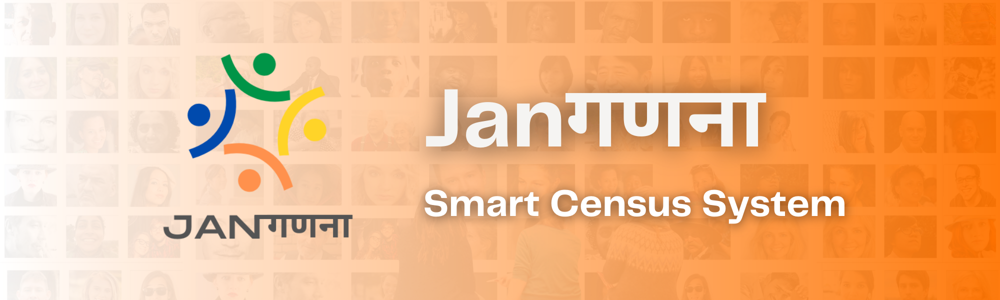

<a name="readme-top"></a>

[![Contributors][contributors-shield]][contributors-url]
[![Forks][forks-shield]][forks-url]
[![Stargazers][stars-shield]][stars-url]
[![Issues][issues-shield]][issues-url]
[![LinkedIn][linkedin-shield]][linkedin-url]

<!-- PROJECT LOGO -->
<br/>
<div align="center">
  <a href="https://github.com/siddhesh-desai/Janaganana">
    
  </a>
    <br>
    <br>

  <h3 align="center"><b>JanaGanana</b></h3>

  <p align="center">
    Janaganana is a cutting-edge smart census system developed to revolutionize the process of conducting digital census in India. The project aims to leverage technology to streamline data collection, enhance accuracy, and improve the overall efficiency of the census process.
    <br />
    <br>
    <a href="https://github.com/siddhesh-desai/Janaganana"><strong>Explore the docs »</strong></a>
    <br />
    <a href="https://github.com/siddhesh-desai/Janaganana">View Demo</a>
    ·
    <a href="https://github.com/siddhesh-desai/Janaganana/issues">Report Bug</a>
    ·
    <a href="https://github.com/siddhesh-desai/Janaganana/issues">Request Feature</a>

  </p>
</div>

<!-- ABOUT THE PROJECT -->
<br>

## ♾️ About The Project

Janaganana is a cutting-edge smart census system developed to revolutionize the process of conducting digital census in India. The project aims to leverage technology to streamline data collection, enhance accuracy, and improve the overall efficiency of the census process. Janaganana incorporates Aadhar-based login for secure access and provides a user-friendly interface for family heads to manage their family members. The application is developed using Java programming language and utilizes Firebase as the database.

The foundation of Janaganana is built on Aadhar-based login, ensuring secure access and authentication for users. With Aadhar integration, individuals can log in using their unique identification credentials, verifying their identity and preventing unauthorized access to the system. This feature establishes a robust security framework, safeguarding sensitive census data.

Janaganana offers a user-friendly interface that allows the designated family head to log in and manage their family members' information. The family head can easily add new members to their family profile, providing accurate and up-to-date data for the census. Additionally, the application allows for the deletion of members in special situations such as marriage or death, ensuring that the census records reflect the most current and accurate information.

The project emphasizes data accuracy and integrity by utilizing Java as the programming language. Java's robustness and versatility make it an ideal choice for building a reliable and scalable system. With its strong ecosystem and extensive libraries, Java enables efficient data handling and processing, ensuring the smooth operation of the Janaganana application.

Janaganana utilizes Firebase as the database to store and manage the census data. Firebase offers a scalable and secure cloud-based solution, providing real-time synchronization and seamless data access across multiple devices. By leveraging Firebase's capabilities, Janaganana ensures efficient data storage, retrieval, and synchronization, facilitating smooth and reliable census management.

The ultimate goal of Janaganana is to digitize and modernize the census process in India. By employing Aadhar-based login, the system ensures secure access and authentication. The user-friendly interface enables family heads to manage their family members' information easily. The integration of Java and Firebase enhances data handling, storage, and synchronization, contributing to a seamless and efficient census process.

Janaganana is designed to streamline the census process, improving data accuracy and efficiency while reducing manual efforts and paperwork. The project represents a significant step towards a digital and technology-driven census system in India, contributing to better planning, resource allocation, and policy-making based on accurate population data.

<p align="right">(<a href="#readme-top">back to top</a>)</p>

## ⚙️ Built With

The technologies and tools used are:

- [![Java][java]][java-url]
- [![Android Studio][android]][android-url]
- [![Firebase][firebase]][firebase-url]

<p align="right">(<a href="#readme-top">back to top</a>)</p>

<!-- GETTING STARTED -->

## 🧑‍💻 Getting Started

Follow the below steps to set up the project:

### Prerequisites

The project needs Android Studio installed in your system. Once installed, follow the below steps:

### Installation

1. Clone the repository

   ```sh
   git clone https://github.com/siddhesh-desai/Janaganana.git
   ```

2. Move into the mobile application folder

   ```sh
   cd Mobile%Application
   ```

3. Connect your device using USB Cable or keep emulator installed. Click on the run button in Android Studio

## 💡 Features

<br>

- Login/Signup using Aadhar
- Details Form
- Add Member
- Delete Member
- Edit Member

<p align="right">(<a href="#readme-top">back to top</a>)</p>

<!-- ROADMAP -->

## 🛣️ Roadmap

- [x] Login/Signup using Aadhar
- [x] Details Form
- [x] Add Member
- [x] Delete Member
- [x] Edit Member

See the [open issues](https://github.com/siddhesh-desai/Janaganana/issues) for a full list of proposed features (and known issues).

<p align="right">(<a href="#readme-top">back to top</a>)</p>

<!-- CONTRIBUTING -->

## 👣 Contributing

Any contributions you make are **greatly appreciated**.

If you have a suggestion that would make this better, please fork the repo and create a pull request. You can also simply open an issue with the tag "enhancement".
Don't forget to give the project a star! Thanks again!

1. Fork the Project
2. Create your Feature Branch (`git checkout -b feature/AmazingFeature`)
3. Commit your Changes (`git commit -m 'Add some AmazingFeature'`)
4. Push to the Branch (`git push origin feature/AmazingFeature`)
5. Open a Pull Request

<p align="right">(<a href="#readme-top">back to top</a>)</p>

<!-- CONTACT -->

## 📧 Contact

Siddhesh Desai - [@thesiddheshdesai](https://www.linkedin.com/in/thesiddheshdesai/) - siddheshdesai777@gmail.com

Project Link: [https://github.com/siddhesh-desai/Janaganana](https://github.com/siddhesh-desai/Janaganana)

<p align="right">(<a href="#readme-top">back to top</a>)</p>

## ✨ Contributors

Thanks go to these wonderful people:

- [Siddhesh Desai](https://github.com/siddhesh-desai/)
- [Om Gore](https://github.com/om9011/)
- [Raj Dharmale](https://github.com/RajDharmale/)
- Shravani Dhamne
- Kaustubh Dharme

[contributors-shield]: https://img.shields.io/github/contributors/siddhesh-desai/Janaganana.svg?style=for-the-badge
[contributors-url]: https://github.com/siddhesh-desai/Janaganana/graphs/contributors
[forks-shield]: https://img.shields.io/github/forks/siddhesh-desai/Janaganana.svg?style=for-the-badge
[forks-url]: https://github.com/siddhesh-desai/Janaganana/network/members
[stars-shield]: https://img.shields.io/github/stars/siddhesh-desai/Janaganana.svg?style=for-the-badge
[stars-url]: https://github.com/siddhesh-desai/Janaganana/stargazers
[issues-shield]: https://img.shields.io/github/issues/siddhesh-desai/Janaganana.svg?style=for-the-badge
[issues-url]: https://github.com/siddhesh-desai/Janaganana/issues
[license-shield]: https://img.shields.io/github/license/siddhesh-desai/Janaganana.svg?style=for-the-badge
[license-url]: https://github.com/siddhesh-desai/Janaganana/blob/master/LICENSE.txt
[linkedin-shield]: https://img.shields.io/badge/-LinkedIn-black.svg?style=for-the-badge&logo=linkedin&colorB=555
[linkedin-url]: https://linkedin.com/in/thesiddheshdesai
[java]: https://img.shields.io/badge/Java-000000?style=for-the-badge&logo=java&logoColor=white
[java-url]: https://docs.oracle.com/en/java/
[android]: https://img.shields.io/badge/Android-0769AD?style=for-the-badge&logo=android&logoColor=white
[android-url]: https://developer.android.com/docs
[firebase]: https://img.shields.io/badge/Firebase-20232A?style=for-the-badge&logo=firebase&logoColor=61DAFB
[firebase-url]: https://firebase.google.com/docs/
